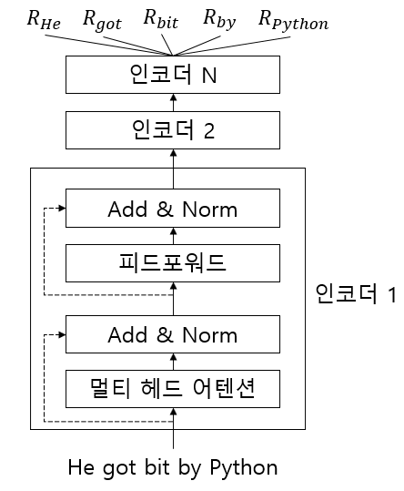
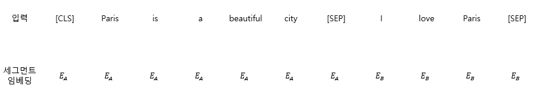
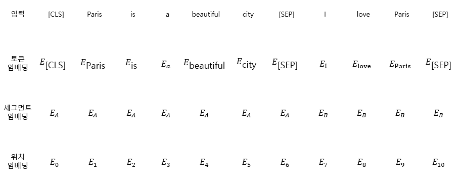

# pytorch로 BERT 구현하기

## 1. BERT의 기본 개념
BERT(Bidirectional Encoder Representation from Transformer)는 구글에서 발표한 임베딩 모델이다. 질문에 대한 대답, 텍스트 생성, 문장 분류 등과 같은 태스크에서 가장 좋은 성능을 도출해 자연어 처리 분야에 크게 기여해왔다.

```
A 문장 : He got bit by Python (파이썬이 그를 물었다)
B 문장 : Python is my favorite programming language(내가 가장 좋아하는 프로그래밍 언어는 파이썬이다)
```

위 두 문장에서 파이썬이라는 단어의 의미는 다르게 적용된다. word2vec과 같은 임베딩을 동일한 단어이기 때문에 동일하게 표현이 된다. BERT는 word2vec과 다르게 문맥 독립 모델이 아닌 문맥 기반 모델이기 때문에 문장의 문맥을 이해한 다음 문맥에 따라 단어 임베딩을 생성한다.

## 2. BERT의 동작 방식
BERT는 트랜스포머 모델을 기반으로 하며, 인코더-디코더 형태가 아닌 인코더만 사용한다.

<figure style="display:block; text-align:center;">
    
    <figcaption style="text-align:center;"><b>BERT 구조</b></figcaption>
</figure>

## 3. BERT 구조
- 인코더 레이어 수는 L로 표시
- 어텐션 헤드는 A로 표시
- 히든 유닛은 H로 표시

### 3.1. BERT-base
BERT-base는 12개의 인코더 레이어가 스택처럼 쌓인 형태로 구성되어 있다. 모든 인코더는 12개의 어텐션 헤드를 사용하며, 인코더의 피드포워드 네트워크는 768개 차원의 헤든 유닛으로 구성된다.
L = 12, A = 12, H = 768

### 3.2. BERT-lage
BERT-lage는 24의 인코더 레이어가 스택처럼 쌓인 형태로 구성되어 있다. 모든 인코더는 16개의 어텐션 헤드를 사용하며, 인코더의 피드포워드 네트워크는 1024개 차원의 헤든 유닛으로 구성된다.
L = 24, A = 16, H = 1024

### 3.3 그밖의 여러 BERT 구조
- BERT-tiny : L = 2, A = 2, H = 128
- BERT-mini : L = 4, A = 4, H = 256
- BERT-small : L = 4, A = 8, H = 521
- BERT-medium : L = 8, A = 8, H = 521

## 4. BERT의 pre-trained
모델을 학습시킬때 특정 태스크에 대한 방대한 데이터셋으로 모델을 시키고 학습된 모델을 저장한다. 새 태스크가 주어지면 임의 가중치로 모델을 초기화하는 대신 이미 학습된 모델의 가중치로 모델을 초기화한다. 모델이 이미 대규모 데이터셋에 학습되어있으므로 새 태스크를 위해 새로운 모델로 처음부터 학습시키는 대신 사전 학습된 모델을 사용하고 새로운 태스크에 따라 가중치를 조정(fine tuning)한다.

BERT는 MLM(Masked Language Model)과 NSP(Next Sentence Prediction)라는 두 가지 태스크를 이용해 거대한 말뭉치를 기반으로 사전 학습된다. 사전 학습 후 사전 학습된 BERT를 저장해두고, 새로운 태스크가 주어질 경우 BERT를 처음부터 학습시키는 대신 사전 학습된 BERT를 사용한다.

### 4.1. BERT의 입력 표현
BERT에 데이터를 입력하기 전에 세 가지 임베딩 레이어를 기반으로 입력 데이터를 임베딩으로 변환해야 한다.
- 토큰 임베딩(token embedding)
- 세그먼트 임베딩(segment embedding)
- 위치 임베딩(position embedding)

#### 4.1.1 토큰 임베딩
기본적으로 트랜스포머와 같이 단어를 토큰화한다.

```
A : Paris is a beautiful city
B : I love paris
tokens = [Paris, is , a, beautiful, city, I, love, Paris]
```

그 후 첫 번째 문장의 시작 부분에만 [CLS] 토큰이라는 새 토큰을 추가한다.

```
token = [[CLS], Paris, is , a, beautiful, city, I, love, Paris]
```

그런 다음 모든 문장 끝에 [SEP]라는 토큰을 추가한다.

```
token = [[CLS], Paris, is , a, beautiful, [SEP], city, I, love, Paris, [SEP]]
```

[CLS] 토큰은 분류 작업에 사용되며, [SEP] 토큰은 모든 문장의 끝을 나타내는데 사용된다.

#### 4.1.2 세그먼트 임베딩

세그먼트 임베딩은 주어진 두 문장을 구분할때 사용된다. 
<figure style="display:block; text-align:center;">
    
    <figcaption style="text-align:center;"><b>세그먼트 임베딩</b></figcaption>
</figure>

#### 4.1.3 위치 임베딩

트랜스포머의 포지션 인코딩을 사용하여 모든 단어를 병렬로 처리한다. BERT는 본질적으로 트랜스포머의 인코더이므로 BERT 데이터를 직접 입력하기 전에 문장에서 토큰의 위치에 대한 정보를 제공해야한다.

#### 4.1.4 입력 데이터

<figure style="display:block; text-align:center;">
    
    <figcaption style="text-align:center;"><b>입력 데이터</b></figcaption>
</figure>

최종적으로 BERT는 주어진 문장을 토큰으로 변환하고 토큰을 토큰 임베딩, 세그먼트 임베딩, 위치 임베딩 레이어에 넣고 임베딩을 얻는다. 그 다음 모든 임베딩을 합산해 BERT에 입력으로 제공한다.

### 4.2. 사전 학습 전략
BERT는 두 가지 태스크에 대해 사전 학습된다.
- 마스크 언어 모델링(MLM)
- 다음 문장 예측(NSP)

#### 4.2.1 언어 모델링
언어 모델링은 일반적으로 임임의 문장이 주어지고 