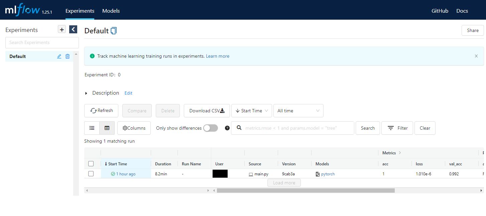
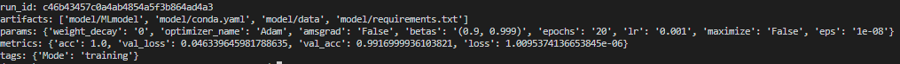
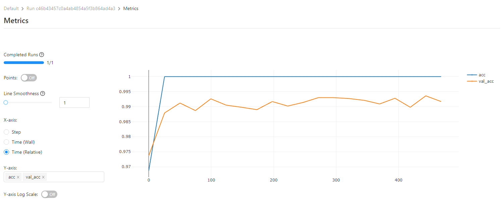

# MLflow

MLflow 는 코드 패킹, 실험 추적, 모델 공유 및 배포를 간소화하는 플랫폼이다. MLflow 에서는 Tensorflw, Pytorch, XGBoost 등 많은 기계 학습 라이브러리를 사용 할 수 있는 API 를 제공한다.

MLflow의 기능은 크게 4가지가 있다.
- Tracking : 파라미터, 코드, 실험 결과를 대화형 UI 형태를 사용하여 비교하는 API
- Project : Conda 혹은 Docker 를 사용하여 재현 가능한 실험을 위한 코드 패키징
- Models : Docker, Apache Spark, Azure ML 및 AWS SageMaker 와 같은 플랫폼에서 쉽게 배포 할 수 있는 모델 패키징
- Model Registry : MLflow 모델의 전체 수명 주기를 공동으로 관리하기 위한 중앙 집중식 모델 저장소

설치
```
pip install mlflow
```

UI 서버
- mlruns 폴더가 있는 곳에서
```
mlflow ui
```
  


테스트 코드
```python
import os
import torch
import torch.nn.functional as F
import torchvision.transforms as transforms
import pytorch_lightning as pl
import mlflow

from torch import optim, nn, utils, Tensor
from torchvision.datasets import MNIST
from torchmetrics.functional import accuracy

from mlflow.tracking import MlflowClient

class MnistCNN(pl.LightningModule):
    def __init__(self, dropout=0.1) -> None:
        super().__init__()
        self.dropout = dropout

        # L1 shape = (?, 28, 28, 1)
        #    Conv  -> (?, 28, 28, 32)
        #    Pool  -> (?, 14, 14, 32)
        self.layer1 = nn.Sequential(
            nn.Conv2d(1, 32, kernel_size=3, stride=1, padding=1),
            nn.ReLU(),
            nn.MaxPool2d(kernel_size=2, stride=2)
        )

        # L2 shape = (?, 14, 14, 32)
        #    Conv  -> (?, 14, 14, 64)
        #    Pool  -> (?, 7, 7, 64)
        self.layer2 = nn.Sequential(
            nn.Conv2d(32, 64, kernel_size=3, stride=1, padding=1),
            nn.ReLU(),
            nn.MaxPool2d(kernel_size=2, stride=2)
        )

        # L3 shape = (?, 7, 7, 64)
        #    Conv  -> (?, 7, 7, 128)
        #    Pool  -> (?, 4, 4, 128)
        self.layer3 = nn.Sequential(
            nn.Conv2d(64, 128, kernel_size=3, stride=1, padding=1),
            nn.ReLU(),
            nn.MaxPool2d(kernel_size=2, stride=2, padding=1)
        )

        # L4 FC 4x4x128 -> 625
        self.fc1 = nn.Linear(4 * 4 * 128, 625, bias=True)
        self.layer4 = nn.Sequential(
            self.fc1,
            nn.ReLU(),
            nn.Dropout(p=self.dropout)
        )

        # L5 FC 625 -> 10
        self.fc2 = nn.Linear(625, 10, bias=True)

    def forward(self, x):
        outputs = self.layer1(x)
        outputs = self.layer2(outputs)
        outputs = self.layer3(outputs)
        outputs = outputs.view(outputs.size(0), -1)
        outputs = self.layer4(outputs)
        outputs = self.fc2(outputs)

        return outputs

    def training_step(self, batch, batch_idx):
        x, y = batch
        y_hat = self(x)
        loss = F.cross_entropy(y_hat, y)
        acc = accuracy(y_hat, y)
        metrics = {"acc":acc, "loss":loss}
        self.log_dict(metrics)
        return metrics
    
    def validation_step(self, batch, batch_idx):
        x, y = batch
        pred_y = self(x)
        acc = accuracy(pred_y, y)
        loss = F.cross_entropy(pred_y, y)
        metrics = {"val_loss":loss, "val_acc":acc}
        self.log_dict(metrics)

    def configure_optimizers(self):
        return optim.Adam(self.parameters(), lr=1e-3)

def print_auto_logged_info(r):
    tags = {k: v for k, v in r.data.tags.items() if not k.startswith("mlflow.")}
    artifacts = [f.path for f in MlflowClient().list_artifacts(r.info.run_id, "model")]
    print("run_id: {}".format(r.info.run_id))
    print("artifacts: {}".format(artifacts))
    print("params: {}".format(r.data.params))
    print("metrics: {}".format(r.data.metrics))
    print("tags: {}".format(tags))

if __name__ == "__main__":
    # setup data
    mnist_train = MNIST(root=os.getcwd(),
                          train=True,
                          transform=transforms.ToTensor(),
                          download=True)

    mnist_test = MNIST(root=os.getcwd(),
                            train=False,
                            transform=transforms.ToTensor(),
                            download=True)
    train_loader = utils.data.DataLoader(mnist_train, batch_size=64)
    val_loader = utils.data.DataLoader(mnist_test, batch_size=64)
    
    mnist = MnistCNN()

    trainer = pl.Trainer(max_epochs=20)

    mlflow.pytorch.autolog()

    with mlflow.start_run() as run:
        trainer.fit(mnist, train_dataloaders=train_loader, val_dataloaders=val_loader)

    print_auto_logged_info(mlflow.get_run(run_id=run.info.run_id))
```

실행 결과


mlflow ui 에서는 아래 사진과 같이 log 를 남긴 metrics 를 도식해 볼 수 있다  
