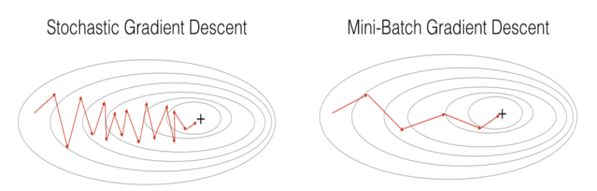

# 경사 하강 알고리즘(Gradient Descent Alogorithm)

딥러닝 학습에 있어서 레이블값과 예측값을 얼마나 틀리는지를 표시한 값이 오차(loss)이다. 이러한 오차를 알게하는 함수가 오차 함수(loss function)이다. 오차 함수의 최소값을 찾는 것이 학습의 목표이다.

이러한 최소값을 찾는 과정을 최적화(optimization)라고 하고 이를 수행하는 알고리즘이 최적화 알고리즘(optimizer)이다.

Gradient Decent 알고리즘은 다음과 같다.

$$\theta_{t+1} = \theta_t - \eta\nabla_\theta J(\theta)$$

η : learning rate  
J(θ) : loss function

## Batch Gradient Desent(GD)
전체 데이터 셋에 대한 오차를 구한 후 기울기를 한번만 계산하여 모델의 파라미터를 업데이트하는 방법  

- 장점
    - 전체 데이터에 대한 업데이트가 한번에 이루어져 전체적인 계산 횟수가 적다
    - 전체 데이터에 대해 오차를 계산하기 때문에 최적화 수렵이 안정적으로 진행된다
    - 병렬 처리에 유리하다
- 단점
    - 한 스텝에 모든 학습 데이터 셋을 사용하기 때문에 오래 걸린다
    - 전체 학습 데이터에 대한 오차를 업데이트 전까지 메모리에 축적하여 많은 메모리가 필요하다
    - local optimal 상태가 되면 빠져나오기 힘들다

## Stochastic Gradient Desent(SGD)
추출된 데이터 한 개에 대해서 오차를 계산하는 방법  

- 장점
    - shooting이 일어나기 때문에 local optimal에 빠질 위험이 적다
    - step에 걸리는 시간이 짧기 때문에 수렴속도가 상대적으로 빠르다
- 단점
    - global optimal을 찾기 못 할 가능성이 있다
    - 데이터를 한개씩 처리하기 때문에 병렬 처리로 할 수 없다

## Mini-batch Gradient Desent(MSGD)
전체 데이터 셋에서 뽑은 Mini-batch 안의 데이터 N개에 대해서 각 데이터에 대한 기울기를 구한 뒤, 그것의 평균 기울기를 통해 모델을 업데이트하는 방법

- 장점
    - GD보다 local optimal에 빠질 위험이 적다
    - SDG보다 병렬 처리에 유리하다
    - 전체 학습데이터가 아니라 일부분의 학습데이터만 사용하기 때문에 메모리 사용량이 적다
- 단점
    - batch-size 를 설정해야 한다
    - 에러에 대한 정보를 mini-batch 크기 만큼 축적해서 SGD 보다 메모리 사용이 높다