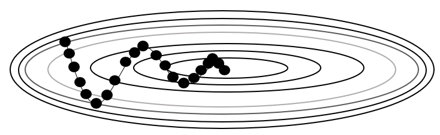
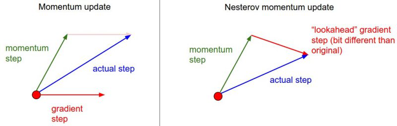

# Momentum

$$\nu = \alpha\nu - \eta\frac{\partial L}{\partial W}$$  
$$W = W + \nu$$  

SGD와 달리 Momentum은 기울기 방향으로 힘을 받아 물체가 가속되어 궁이 구르는 듯한 관성이 적용된다.  
위식에서 α가 가속도와 관련된 파라미터이다. 자주 이동하는 방향에 관성이 걸리게 되고 중앙으로 가는 방향에 힘을 얻기 때문에 SGD보다 상대적으로 빠르게 이동 할 수 있다. 하지만 과거에 이동했던 변수별로 저장해야하므로 변수에 대한 메모리가 기존에 비해 두배로 필요하다.

# Nesterov Accelerated Gradient (NAG)

  

Momentum 에서는 이동 벡터를 계산할 때 현재 위치에서의 기울기와 스텝을 독립적으로 계산하고 합친다. NAG에서는 스텝을 먼저 고려하고 기울기를 구해서 이동한다. Momentum 방식에서 멈춰야 할 시점에서도 관성에 의해 더 멀리 갈 수 있다는 단점이 존재한다. NAG 방식의 경우 Momentum으로 이동을 반 정도 한 후 어떤 방식으로 이동해야할지 결정한다. Momentum 방식의 빠른 이동에 대한 이점과 멈춰야 할 시점에서 제동을 거는 데에 훨씬 용이하다.

