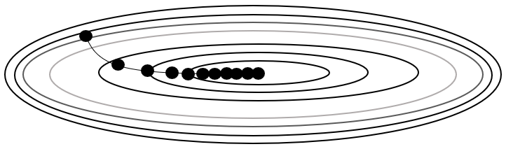

# Adaptive Gradient(Adagrad)

  

업데이트 할 때 각각의 변수마다 스텝 크기를 다르게 설정해서 이동하는 방식으로 자주 등장하거나 변화를 많이 한 변수들의 경우 optimum에 가까이 있을 확률이 높기 때문에 스텝 크기를 줄여 세밀한 값을 조정한다. 적게 변화한 변수들은 optimum 값에 도달하기 위해서 많이 이동해야할 확률이 높기 때문에 오차 값을 빠르게 줄이기 위해 스텝 크기를 크게 한다.

# AdaDelta
